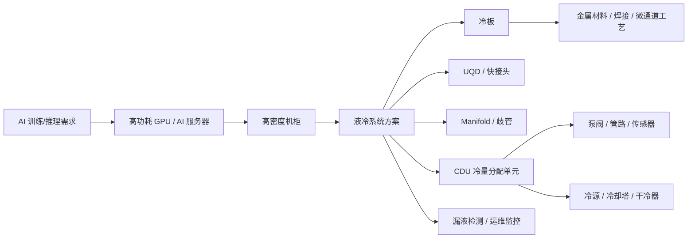

# AI 算力液冷产业链样板页

> 页面定位：产业链学习内容样板，不构成投资建议。  
> 内容状态：draft。  
> 证据口径：本版主要基于公开白皮书、行业报道、券商报告和媒体整理；公司映射多数仍需继续补公司年报、公告、互动问答或投资者关系记录。

## 0. 页面元信息

| 字段 | 内容 |
| --- | --- |
| chain_id | `ai-liquid-cooling` |
| title | AI 算力液冷 |
| aliases | 数据中心液冷、AIDC 液冷、冷板式液冷、浸没式液冷、服务器液冷 |
| category | AI 硬件 / 数据中心基础设施 |
| status | draft |
| updated_at | 2026-06-20 |
| structured_data | `data/industry-chains/chains/ai-liquid-cooling.json` |

## 1. 一句话

AI 算力液冷解决的是高功耗 GPU / AI 服务器在高密度机柜里“风冷散不动、能耗压不下、部署密度上不去”的问题。

它不是一个单一设备，而是一整套从芯片热源、冷板、快接头、歧管、CDU、泵阀、管路、冷却液、冷源到运维监控的系统工程。

## 2. 先看这 5 个问题

### 谁在买？

主要买方是高密度算力基础设施建设方：

- 互联网云厂商。
- 电信运营商。
- 智算中心。
- 超算中心。
- 政府、金融、能源等高算力场景。

### 为什么现在变重要？

AI 芯片和 AI 服务器功耗提高，单机柜功率密度上升，传统风冷的散热效率和能耗表现越来越难满足高密度部署。

同时，数据中心 PUE 监管和绿色低碳要求提高，液冷从“可选技术”逐步变成高密度 AI 数据中心的必要方案。

### 卡点在哪里？

第一层卡点是系统可靠性：

- 漏液风险。
- 快接头兼容性。
- 冷却液稳定性。
- 冷板换热效率。
- CDU 控制和冗余。
- 机柜级管路和 manifold 设计。

第二层卡点是客户验证：

- AI 服务器平台认证。
- 云厂商导入。
- 机房运维接受度。
- 批量交付能力。
- 标准化接口和跨厂商兼容。

### 谁能真正收钱？

更接近收入兑现的节点通常是：

- 全链条液冷解决方案供应商。
- 冷板 / CDU / UQD / manifold 等核心部件供应商。
- 服务器和数据中心集成商。
- 泵阀、管路、冷却液等二阶部件和材料供应商。

但是否真正受益，必须继续看：

- 液冷相关收入占比。
- 客户认证。
- 订单和交付。
- 毛利率和现金流。
- 是否只是概念相关。

### 什么情况说明逻辑错了？

- AI 数据中心资本开支低于预期。
- 液冷渗透率不及预期，风冷或混合冷却继续占主导。
- 标准不统一导致规模化部署受阻。
- 产品同质化导致价格战。
- 公司只有概念标签，没有液冷收入、客户、订单或量产证据。
- 相关公司应收、库存、现金流恶化，收入没有变成利润和现金流。

## 3. 核心产业链路径



## 4. 图谱节点

| node_id | 节点 | 层级 | 小白解释 | 卡点强度 | 证据状态 |
| --- | --- | --- | --- | --- | --- |
| demand-ai-compute | AI 训练/推理需求 | downstream | 大模型训练和推理需要更多 GPU 和服务器。 | 5 | supported |
| ai-server | 高功耗 AI 服务器 | downstream | 单机功耗提高，机柜热密度上升。 | 5 | supported |
| high-density-rack | 高密度机柜 | midstream | 机柜里放更多算力，热量集中，风冷压力变大。 | 5 | supported |
| liquid-system | 液冷系统方案 | midstream | 把热量从服务器带到机房冷源的完整系统。 | 5 | supported |
| cold-plate | 冷板 | component | 贴近 CPU/GPU，把芯片热量传给冷却液。 | 5 | supported |
| uqd | UQD / 快接头 | component | 服务器和液冷管路的快速连接接口，关系到维护和漏液风险。 | 4 | weakly_supported |
| manifold | Manifold / 歧管 | component | 把冷却液分配到机柜内多个服务器节点。 | 4 | weakly_supported |
| cdu | CDU 冷量分配单元 | equipment | 控制冷却液流量、温度、压力，是二次侧核心设备。 | 5 | supported |
| pump-valve-pipe | 泵阀 / 管路 | component | 负责冷却液循环、控制和连接。 | 3 | weakly_supported |
| coolant | 冷却液 | material | 冷板多用水基工质，浸没式常涉及绝缘冷却液。 | 3 | weakly_supported |
| monitoring | 漏液检测 / 运维监控 | service | 液体进机柜后，可靠运维和故障检测变重要。 | 4 | weakly_supported |

## 5. 关系边

| source | target | relation_type | label | 解释 | 证据状态 |
| --- | --- | --- | --- | --- | --- |
| demand-ai-compute | ai-server | demand_pull | 拉动服务器需求 | AI 训练和推理增加高性能服务器需求。 | supported |
| ai-server | high-density-rack | supply_constraint | 形成热密度压力 | GPU 功耗提升使机柜散热压力上升。 | supported |
| high-density-rack | liquid-system | technology_upgrade | 风冷向液冷升级 | 高密度部署和 PUE 约束推动液冷渗透。 | supported |
| liquid-system | cold-plate | key_component | 核心换热部件 | 冷板式液冷通过冷板带走芯片热量。 | supported |
| liquid-system | cdu | key_equipment | 核心控制设备 | CDU 连接机柜侧和冷源侧，控制冷却循环。 | supported |
| cdu | pump-valve-pipe | component_dependency | 依赖循环控制 | 泵阀、管路影响流量、压力和可靠性。 | weakly_supported |
| liquid-system | monitoring | validation | 运维可靠性验证 | 漏液检测、传感和运维是规模化部署前提。 | weakly_supported |

## 6. 技术路线

### 冷板式液冷

冷板式液冷是当前更容易规模化的主流路线。

它的特点：

- 冷却液不直接接触芯片。
- 通过冷板贴近 CPU/GPU 等高发热部件换热。
- 对现有机房和服务器改造难度相对较低。
- 仍需要少量风冷处理非液冷部件。
- 关键在冷板、快接头、歧管、CDU、管路和漏液检测。

适合小白理解为：

```text
把最热的芯片接到一套水路里，让水把热量带走。
```

### 浸没式液冷

浸没式液冷把服务器或部件浸没在绝缘冷却液里。

它的特点：

- 换热效率高。
- 有机会进一步降低 PUE。
- 机房形态、运维习惯、冷却液成本和材料兼容性要求更高。
- 更像面向特定场景的深度改造，不一定是存量数据中心最容易推广的路线。

适合小白理解为：

```text
把服务器泡进不导电冷却液里，让液体直接带走热量。
```

### 喷淋式液冷

喷淋式液冷让冷却液喷淋到发热部件表面，再通过回收循环带走热量。

它的特点：

- 换热路径短。
- 系统设计和运维要求较高。
- 当前更适合作为技术储备和特定场景方案。

## 7. 术语图解

| 图解 | 绑定节点 | 先看什么 | 读完记住什么 |
| --- | --- | --- | --- |
| 风冷 vs 液冷 | high-density-rack、liquid-system | 风冷靠空气带走热量，液冷让冷却液更靠近热源。 | 机柜功率越高，液冷必要性越强。 |
| 冷板怎么带走热量 | ai-server、cold-plate、coolant | CPU/GPU 产生热量，冷板贴近芯片换热，冷却液把热量带走。 | 冷板是冷板式液冷的核心换热部件。 |
| CDU 是什么 | liquid-system、cdu、pump-valve-pipe | CDU 连接服务器侧和机房冷源侧，控制流量、温度、压力。 | CDU 不是普通空调，要确认是不是数据中心液冷 CDU。 |
| UQD / 歧管为什么重要 | uqd、manifold、monitoring | UQD 负责快速连接和密封，歧管负责分配冷却液，监控负责发现风险。 | 液体进机柜后，维护效率和漏液可靠性会变成关键问题。 |

## 8. 当前关键卡点

### 8.1 标准化和兼容性

行业仍存在接口、产品形态、机柜和服务器适配不统一的问题。

这会导致：

- 不同供应商产品难互通。
- 客户更依赖一体化方案商。
- 供应链认证周期拉长。
- 早期格局容易被少数进入客户体系的厂商锁定。

### 8.2 客户验证

液冷不是单个零件卖出去就结束。

客户真正关心：

- 是否能进入 AI 服务器平台。
- 是否通过云厂商或服务器厂认证。
- 是否能批量交付。
- 是否能长期稳定运行。
- 出问题时能否快速维护。

### 8.3 漏液和可靠性

液冷把液体引入服务器和机柜，可靠性要求比普通散热材料高。

关键包括：

- 快接头密封。
- 管路可靠性。
- 泵阀寿命。
- 冷却液稳定性。
- 漏液检测。
- 运维流程。

### 8.4 收入和利润兑现

液冷概念热不等于利润兑现。

必须继续验证：

- 液冷相关收入占比。
- 毛利率是否提升。
- 订单是否真实交付。
- 应收账款和存货是否同步恶化。
- 是否只是小规模样机或概念布局。

## 9. A 股公司角色草案

> 注意：本表是学习页草案，不是推荐名单。公司角色需要继续用年报、公告、互动问答、投资者关系记录补证据。

| 公司 | 代码 | 对应节点 | 角色 | 当前判断 | 证据状态 | 下一步验证 |
| --- | --- | --- | --- | --- | --- | --- |
| 英维克 | 002837.SZ | 液冷系统 / 冷板 / CDU / UQD / manifold | 显性验证节点 / 全链条方案商 | 2025 年报摘要披露 Coolinside 全链条液冷覆盖冷板、快速接头、Manifold、CDU、液冷工质、管路、冷源等端到端产品；官网产品页可交叉验证 CDU、液冷板、UQD/快接头等具体产品。公司角色可升为强支持，但液冷收入占比、订单利润和现金流兑现仍需继续验证。 | supported | 查 2025 年报全文中的液冷收入和毛利拆分；跟踪 2026 中报订单、收入和现金流；区分数据中心液冷、储能液冷和传统机房温控收入。 |
| 高澜股份 | 300499.SZ | 液冷系统 / 冷板 / 浸没式方案 | 弹性候选 | 2025 半年度报告披露数据中心液冷产品覆盖服务器液冷板、流体连接部件、CDU、TANK、换热单元等，并形成冷板式和浸没式方案。角色强支持，但客户、订单和收入占比仍需验证。 | supported | 查 2025 年报全文的数据中心液冷收入和订单；确认冷板、CDU、TANK 的客户和交付规模。 |
| 申菱环境 | 301018.SZ | 数据中心温控 / 液冷系统 / CDU | 显性验证节点 / CDU 方案商 | 2025 年报摘要和 2025 半年度报告披露数据服务产品覆盖液冷系列，并提到液冷数据中心 CDU 厂商排名靠前。可作为 CDU/温控验证节点，但仍要拆清液冷收入和订单交付。 | supported | 查 2025 年报全文的数据服务板块收入、订单和毛利；跟踪海外业务和液冷订单交付。 |
| 同飞股份 | 300990.SZ | 液冷系统 / CDU / Manifold | 二阶受益候选 / 方案拓展 | 投资者关系记录和互动平台显示公司在数据中心液冷有产品线线索，覆盖 CDU、Manifold、预制化管路、干冷器、集成冷站和 TANK。当前为弱支持，仍缺收入、客户和订单强验证。 | weakly_supported | 查 2025 年报全文和 2026 中报的数据中心液冷收入；确认 CDU、Manifold、TANK 是否有量产客户。 |
| 飞荣达 | 300602.SZ | 冷板 / CDU / 流量监控 | 热管理部件候选 / 量产线索 | 2024 年报摘要披露 AI 服务器液冷相关业务获得批量订单并量产；2025 年报摘要进一步列出数据中心 CDU、流量监控仪等产品。角色强支持，但客户名称、订单金额和收入拆分仍待核实。 | supported | 查 2025 年报全文里的 AI 服务器液冷收入和客户；确认 CDU、液冷模组、流量监控等产品量产规模。 |
| 川环科技 | 300547.SZ | 管路 / 流体连接 | 管路部件候选 / 供应链导入 | 2025 半年度报告披露某液冷服务器冷却系统管路产品已研发成功、客户验证合格并批量供货；IR 记录披露进入多家供应商体系。角色强支持，但服务器液冷收入占比仍较小。 | supported | 跟踪服务器液冷管路收入占比；确认客户认证、供货规模和持续订单。 |
| 飞龙股份 | 002536.SZ | 泵 / 阀 / 热管理部件 | 液冷泵新兴布局 / 二阶观察 | 2025 年报披露热管理技术从汽车延伸至服务器液冷、数据中心等新兴领域，并开发商用液冷泵。当前为弱支持，数据中心客户、订单和非车收入占比仍需验证。 | weakly_supported | 确认服务器液冷泵客户和订单金额；跟踪非车用液冷泵收入占比和量产交付。 |
| 紫光股份 | 000938.SZ | 液冷服务器 / 数据中心集成 | 下游验证节点 | 紫光股份/新华三披露全冷板液冷服务器、UniPoD 超节点、高密液冷整机柜等产品和方案。它是下游液冷服务器需求验证锚，不是上游部件直接卡点。 | supported | 查 2025 年报全文中的液冷服务器/整机柜收入和毛利；确认项目部署数量。 |
| 浪潮信息 | 000977.SZ | 液冷服务器 / 液冷数据中心 | 下游验证节点 | 浪潮信息官网和年报/半年报资料显示其全栈布局液冷，覆盖一次侧冷源、二次侧 CDU、液冷连接系统、液冷服务器等；连续多年位居中国液冷服务器市场第一。 | supported | 查 2025 年报中的服务器毛利率、存货和减值压力；跟踪液冷服务器订单和交付。 |

## 10. 公司分层

### 真瓶颈候选

本版暂不直接给“真瓶颈”。

原因：

- 当前多数公司已经能证明“产业链角色相关”，但还不能证明“利润弹性最大”。
- 液冷相关收入占比、客户、订单和交付仍需继续拆分。
- 产业仍在快速标准化，格局未完全固化。

### 显性验证节点

- 英维克：已可作为全链条液冷方案验证锚，但不能直接等同于业绩完全兑现。
- 申菱环境：可作为 CDU / 数据中心温控验证节点，重点看液冷订单和数据服务板块兑现。
- 紫光股份：下游 AI 服务器和液冷整机柜验证锚。
- 浪潮信息：下游液冷服务器渗透率验证锚。

它们能帮助观察液冷需求是否真实扩散，但是否有最高弹性要另查收入占比和盈利质量。

### 弹性候选

- 高澜股份。
- 同飞股份。
- 飞荣达。
- 川环科技。
- 飞龙股份。

这些公司可能对应局部节点，但必须继续验证：

- 是核心产品还是边缘产品。
- 是批量交付还是样机/试点。
- 是直接客户还是间接供应链。
- 是收入已体现还是未来规划。

### 蹭概念风险

以下情况要直接降级：

- 只提“公司有液冷概念”。
- 只有市场软件标签，没有公告或年报证据。
- 主营仍是传统业务，液冷收入极小。
- 只供应低价值通用件，缺少客户认证。
- 股价已经大幅演绎，但财务没有体现。

## 11. 市场催化

| 时间维度 | 催化 | 为什么重要 | 跟踪什么 | 风险 |
| --- | --- | --- | --- | --- |
| 短期 | AI 服务器订单和液冷服务器产品发布 | 最直接验证下游需求是否真实，是液冷链条能否继续扩散的起点。 | 服务器厂商产品、云厂商资本开支、项目中标、AI 服务器出货。 | 服务器订单放量不代表上游部件都有利润弹性。 |
| 中期 | 高密度机柜和 PUE 约束加强 | 当机柜功率密度继续上升，液冷从可选方案变成更刚性的基础设施。 | 单机柜功率、数据中心改造、液冷机柜渗透率、行业白皮书。 | 如果功率密度提升慢，液冷渗透率可能低于市场预期。 |
| 兑现 | 核心部件订单和液冷收入占比披露 | 最终要从产业逻辑落到上市公司收入、毛利和现金流。 | 冷板、CDU、UQD、歧管订单；年报分部；合同负债；毛利率。 | 收入占比小或利润率低时，主题热度可能无法兑现成业绩。 |

## 12. 跟踪指标

| 指标 | 为什么重要 | 数据源 |
| --- | --- | --- |
| AI 服务器出货 / 云厂商资本开支 | 决定液冷需求总量。 | 云厂商财报、服务器行业报告、IDC 等 |
| 单机柜功率密度 | 功率越高，液冷必要性越强。 | 服务器平台资料、白皮书、行业报告 |
| 液冷服务器渗透率 | 判断从可选项到必选项的速度。 | IDC、行业报告、券商报告 |
| PUE 政策要求 | 政策约束推动低能耗方案。 | 政策文件、数据中心标准 |
| 冷板 / CDU / UQD / manifold 订单 | 验证核心部件是否放量。 | 公司公告、年报、IR |
| 客户认证 / 平台适配 | 判断是否进入供应链。 | 公司公告、客户新闻、互动问答 |
| 液冷相关收入占比 | 判断是否真受益。 | 年报、半年报、财报附注 |
| 毛利率 / 现金流 / 应收 | 判断收入是否变成利润和现金。 | 财报 |

## 13. 常见误区

### 误区 1：有液冷概念就是核心受益

不对。

液冷链条很长，从冷源、CDU、冷板、接头、管路、冷却液到服务器和数据中心集成都有公司相关。

不同节点价值量、壁垒和利润弹性差异很大。

### 误区 2：服务器厂商就是最大受益方

不一定。

服务器厂商能验证需求，但利润可能被竞争、客户议价和硬件成本压缩。

真正的卡点可能在冷板、CDU、快接头、manifold 或系统可靠性。

### 误区 3：冷板式、浸没式、喷淋式是同一种机会

不对。

冷板式更适合现有数据中心平滑升级，浸没式和喷淋式更强调系统改造和运维模式变化。

不同技术路线对应的设备、材料、客户和商业化节奏不一样。

### 误区 4：行业增长等于公司利润增长

不一定。

如果公司只是通用部件供应商，或者液冷业务占比低，行业增长未必能显著改变利润表。

## 14. 本页还缺什么证据

下一版需要补：

- 各公司液冷相关收入占比和毛利拆分。
- 各公司客户认证、订单金额、持续交付和项目落地。
- 冷板、CDU、UQD、manifold 的价值量拆分。
- 不同技术路线在国内数据中心的真实渗透率。
- 已经明显过热或证伪的公司案例。

## 15. 自定义内容块建议

### 图块 1：三种液冷路线对比

| 路线 | 优点 | 难点 | 当前位置 |
| --- | --- | --- | --- |
| 冷板式 | 兼容现网、成熟度较高、适合平滑升级 | 仍需风冷辅助，接口和漏液可靠性重要 | 当前主流 |
| 浸没式 | 换热效率高、PUE 潜力更低 | 改造成本、冷却液、材料兼容和运维要求高 | 特定场景 |
| 喷淋式 | 直接接触发热部件，散热效率高 | 系统设计和运维复杂 | 技术储备 / 小规模场景 |

### 图块 2：价值链卡点

```text
需求不是卡点：AI 算力需求已经较明确。
卡点在交付：能否稳定、批量、低风险地把液冷系统交付到高密度机柜。
公司判断重点：不是有没有液冷，而是有没有客户认证、订单、收入占比和现金流兑现。
```

## 16. 资料来源

本页初稿主要参考：

- 中国通信企业协会等，`智算背景下冷板式液冷技术应用研究`，2025-06。
- Vertiv，`数据中心液冷解决方案`白皮书。
- 巨潮资讯，`英维克 2025 年年度报告摘要`，2026-04-21。
- 英维克官网，`机架式液液 CDU`、`液冷板`、`冷却应用快速接头-UQD 系列`。
- 东方财富公告 PDF，`英维克 2026-001 投资者关系活动记录表`，2026-04-21。
- 新浪财经公告 PDF，`高澜股份 2025 年半年度报告全文`，2025-08-23。
- 东方财富公告 PDF，`申菱环境 2025 年年度报告摘要`，2026-04-26。
- 巨潮资讯，`申菱环境 2025 年半年度报告全文`，2025-08-29。
- 腾讯财经公告 PDF，`同飞股份 2025-004 投资者关系活动记录表`，2025-09-15。
- 巨潮资讯，`飞荣达 2024 年年度报告摘要`，2025-04-16。
- 巨潮资讯，`川环科技 2025 年半年度报告全文`，2025-08-12。
- 巨潮资讯，`川环科技 2025-002 投资者关系活动记录表`，2025-09-12。
- 深交所披露 PDF，`飞龙股份 2025 年年度报告全文`，2026-03-20。
- 证券日报信披 PDF，`紫光股份 2025 年度董事会工作报告`，2026-04-14。
- 浪潮信息官网，`液冷数据中心解决方案`、`Omdia：浪潮信息居数据中心液冷基础设施市场全球前五`。
- 新华网，`AI发展加速液冷技术渗透 多家上市公司深度布局`，2025-08-25。
- 证券时报，`AI发展加速液冷技术渗透 行业正处强劲上升周期`，2025-08-25。
- 21 经济网，`英维克背靠英伟达，“大树”下好乘凉？`，2025-08-22。
- 多份公开券商报告和产业链整理文章，仅作为二级资料线索。

证据等级说明：

- 白皮书 / 行业研究：用于技术路线、产业结构和卡点解释。
- 新闻 / 媒体：用于行业趋势和公司线索，不单独支持强结论。
- 券商报告：用于产业链拆分和公司候选，不单独支持强结论。
- 公司公告 / 年报 / IR：用于把 `candidate` 升级为 `supported`；本轮已给 9 家公司补了一轮，下一轮重点从“角色确认”进入“收入和订单确认”。
