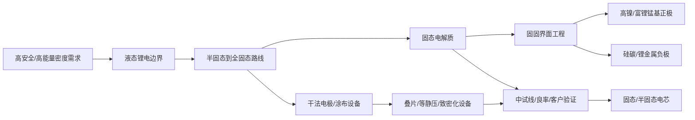

# 固态电池产业链学习页

> 页面定位：产业链学习内容样板，不构成投资建议。  
> 内容状态：draft。  
> 证据口径：本版优先使用公司年报、半年度报告和投资者关系记录；媒体和研报只作为产业线索，不能单独支撑公司强结论。

## 0. 页面元信息

| 字段 | 内容 |
| --- | --- |
| chain_id | `solid-state-battery` |
| title | 固态电池 |
| aliases | 全固态电池、半固态电池、准固态电池、固态锂电池 |
| category | 新能源车 / 动力电池材料与设备 |
| status | draft |
| updated_at | 2026-06-20 |
| structured_data | `data/industry-chains/chains/solid-state-battery.json` |

## 1. 一句话

固态电池解决的是传统液态锂电在安全性、能量密度和极限快充上的边界问题。

小白不要先问“谁是固态电池概念股”，而要先问 5 个问题：

- 这是半固态、准固态，还是全固态？
- 有样品，还是已经中试线贯通？
- 良率、成本和客户验证到哪一步了？
- 真正新增的是固态电解质、正负极适配、设备，还是只是电芯厂验证？
- 相关公司有没有收入占比、订单、客户和公告级证据？

## 2. 核心认知链

这条链要从远到近看：

1. 远因是下游想要更安全、更高能量密度的电池。
2. 约束是液态锂电继续提升越来越难。
3. 路线分成半固态、准固态、全固态，商业化难度不同。
4. 材料卡点是固态电解质、固固界面、正负极适配。
5. 制造卡点是干法电极、叠片、等静压、中试良率。
6. 投资验证最终落到客户、订单、收入占比和现金流。

## 3. 为什么不能把半固态和全固态混在一起

半固态更像过渡路线，保留部分液态成分，和现有锂电体系兼容度更高，落地更快。

全固态更像长期路线，材料体系和制造工艺变化更深，但更难：

- 固态电解质要兼顾高离子电导率、稳定性和成本。
- 固体和固体之间接触不充分，界面阻抗和循环寿命更难。
- 正极、负极、电解质和压力控制要一起适配。
- 设备需要从实验室样品放大到稳定产线。

因此，看到“固态电池”四个字时，第一步不是兴奋，而是拆口径。

## 4. 最核心的三个卡点

### 4.1 固态电解质

固态电解质替代传统液态电解液承担锂离子传导，是固态电池最核心的材料变化之一。

重点看：

- 氧化物、硫化物、聚合物还是复合路线。
- 小试、中试、吨级、百吨级分别到了哪一步。
- 有没有客户认证和导入。
- 有没有收入占比和订单。

### 4.2 固固界面

液态电解液可以浸润电极，固态电池里固体和固体接触不充分，界面会变成难点。

重点看：

- 正极表面修饰和包覆。
- 电解质和电极的界面稳定性。
- 锂枝晶和循环寿命。
- 加压、复合、致密化等制造工艺。

### 4.3 制造设备和中试良率

固态电池从实验室到量产线，中间隔着设备、良率和成本。

重点看：

- 干法电极。
- 固态电解质膜制备。
- 复合转印。
- 无隔膜叠片。
- 冷/热压、等静压。
- 中试线贯通和良品率。
- 量产线设计和客户验证。

## 5. A 股映射先分角色

### 电芯验证锚

这类公司回答“固态电池产业化走到哪一步”。

- 宁德时代：更适合作为行业节奏验证锚。
- 国轩高科：投资者关系记录披露全固态中试线贯通、良率和 2GWh 量产线设计，适合做中试验证样本。

### 材料端核心候选

这类公司回答“材料卡点是不是开始被客户验证”。

- 当升科技：半年度报告直接披露固态正极材料、氧化物固态电解质百吨级中试线、硫化物电解质小试线和客户认证导入。
- 厦钨新能：投资者交流材料披露氧化物路线正极材料供货、氧化物固态电解质吨级生产和硫化物路线样品验证。
- 瑞泰新材：有固态电解质和 LiTFSI 应用线索，但收入占比仍要谨慎。
- 容百科技：有固态正极材料和硫化物电解质布局线索，但本版还需要补公司公告和年报原文，因此先按弱支持。

### 设备端验证锚

这类公司回答“能不能从实验室样品放大到产线”。

- 先导智能：公开资料显示固态电池设备覆盖干法电极、固态电解质膜、叠片、等静压、化成分容等环节；后续要继续补公告、年报里的订单和收入占比。

### 概念风险样本

这类公司用来提醒用户：不是所有被市场点名的公司都能直接当受益股。

- 上海洗霸：公开报道提示固态相关业务尚未形成稳定收入，且曾被监管关注，适合做概念风险教学样本。

## 6. 看公司时的证据阶梯

| 证据层级 | 含义 | 投研判断 |
| --- | --- | --- |
| 样品/研发 | 公司有研发或样品 | 只能说明相关，不能说明受益 |
| 客户测试 | 样品进入客户验证 | 仍需看客户是谁、验证是否通过 |
| 中试线 | 工艺开始工程化 | 证据明显增强，但仍不等于量产 |
| 良率/成本 | 中试能稳定跑 | 开始接近商业化判断 |
| 量产线设计 | 公司开始规划产能 | 需要继续看投产和订单 |
| 批量订单/收入 | 进入财务报表 | 才能验证业绩兑现 |

## 7. 常见误读

### 误读 1：半固态等于全固态

半固态和全固态商业化难度不同，对供应链的重构深度也不同。半固态装车不能直接推导全固态材料全面放量。

### 误读 2：样品等于量产

样品、客户测试、中试线、量产线、批量交付是完全不同证据层级。

### 误读 3：所有锂电材料公司都受益

必须看是否有固态专用产品、客户导入、收入占比和路线适配。

### 误读 4：概念热度等于业绩弹性

固态电池概念容易被市场放大。公司如果提示收入占比小、尚未形成稳定收入，应该降级处理。

## 8. 后续跟踪指标

| 指标 | 为什么重要 | 主要来源 |
| --- | --- | --- |
| 全固态中试线贯通和良率 | 判断是否从样品阶段进入工程化验证 | 电芯厂公告、投资者关系、年报 |
| 固态电解质中试产能和客户认证 | 判断核心材料是否可能规模化供货 | 材料公司公告、年报、IR |
| 固态正极材料出货和收入占比 | 判断正极材料公司是否真受益 | 年报、半年报、客户验证资料 |
| 固态专用设备订单 | 设备订单可能领先材料和电芯收入 | 设备公司公告、合同负债、IR |
| 客户车型和装车进度 | 最终要看电池是否进入真实应用 | 车企发布、工信部目录、公司公告 |
| 相关业务收入占比和毛利率 | 防止小体量研发线索被当成业绩主线 | 年报、财报附注、投资者问答 |

## 9. 本版资料分层

### A 类：公司报告和投资者关系

- 当升科技 2025 半年度报告摘要。
- 国轩高科 2025-004 投资者关系活动记录表。
- 厦钨新能 2025 年半年度业绩说明会投资者关系活动记录表。
- 瑞泰新材 2025 半年度报告。
- 宁德时代 2025 半年度报告。

### B 类：行业和媒体线索

- 先导智能固态电池智能整线解决方案公开报道。
- 容百科技固态材料公开报道。
- 上海洗霸固态电池概念风险报道。
- 固态电池行业研报。

这类资料可以帮我们找线索，但不能替代公司公告、年报和 IR 原文。
