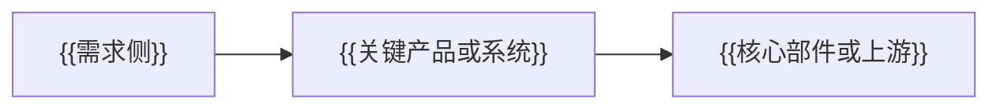

# {{title}}产业链学习页

> 页面定位：产业链学习内容，不构成投资建议。  
> 内容状态：{{status}}。  
> 证据口径：优先使用行业白皮书、公司年报、公告、投资者关系记录和权威媒体；券商报告和市场文章只作为线索。

## 0. 页面元信息

| 字段 | 内容 |
| --- | --- |
| chain_id | `{{chain_id}}` |
| title | {{title}} |
| aliases | {{aliases}} |
| category | {{category}} |
| status | {{status}} |
| updated_at | {{updated_at}} |
| structured_data | `data/industry-chains/chains/{{chain_id}}.json` |

## 1. 一句话

{{用一两句话说明这个产业解决什么问题，不写投资结论。}}

## 2. 先看这 5 个问题

### 谁在买？

{{描述真实买方和需求场景。}}

### 为什么现在变重要？

{{描述产业变化、技术变化、政策变化或资本开支变化。}}

### 卡点在哪里？

{{写技术卡点、交付卡点、认证卡点和商业化卡点。}}

### 谁能真正收钱？

{{按节点解释谁更接近收入兑现，不直接推荐公司。}}

### 什么情况说明逻辑错了？

{{列出需求、技术、价格、竞争、财务等证伪条件。}}

## 3. 核心产业链路径

## 4. 图谱节点

| node_id | 节点 | 层级 | 小白解释 | 卡点强度 | 证据状态 |
| --- | --- | --- | --- | --- | --- |
| {{node_id}} | {{节点名}} | {{upstream/midstream/downstream/component/material/service}} | {{解释}} | {{1-5}} | {{supported/weakly_supported/candidate/unsupported}} |

### 节点教学卡

每个关键节点都要补这 5 项，供页面右侧详情展示：

| node_id | 它是什么 | 为什么重要 | 怎么受益 | 重点看 | 常见误区 |
| --- | --- | --- | --- | --- | --- |
| {{node_id}} | {{一句话解释}} | {{产业链意义}} | {{收入/订单/价值量逻辑}} | {{指标 1；指标 2}} | {{不能误读的地方}} |

## 5. 证据等级

| 状态 | 页面标签 | 含义 | 升级需要什么 |
| --- | --- | --- | --- |
| supported | 强支持 | {{已有较强公开证据支持}} | {{年报/公告/订单/客户/收入占比}} |
| weakly_supported | 弱支持 | {{有公开线索但还缺一手证据}} | {{继续补公司级证据}} |
| candidate | 待验证 | {{逻辑相关但不能确认受益}} | {{确认产品、客户、收入}} |
| unsupported | 证据不足 | {{证据不够或需要降级}} | {{找不到就移除}} |

## 6. 关系边

| source | target | relation_type | label | 解释 | 证据状态 |
| --- | --- | --- | --- | --- | --- |
| {{source_node_id}} | {{target_node_id}} | {{relation_type}} | {{短标签}} | {{关系解释}} | {{evidence_status}} |

## 7. 技术路线

### {{路线 1}}

{{解释路线、优缺点和适用场景。}}

### {{路线 2}}

{{解释路线、优缺点和适用场景。}}

## 8. 术语图解

> 这部分不是堆概念，而是把小白最容易卡住的专业词解释成画面。

| 图解 ID | 标题 | 绑定节点 | 图解流程 | 一句话 takeaway |
| --- | --- | --- | --- | --- |
| {{diagram_id}} | {{术语图解标题}} | {{node_id 1；node_id 2}} | {{步骤 1 -> 步骤 2 -> 步骤 3}} | {{用户读完应该记住什么}} |

## 9. 当前关键卡点

### 9.1 {{卡点 1}}

{{解释为什么是卡点，如何影响产业链。}}

### 9.2 {{卡点 2}}

{{解释为什么是卡点，如何影响产业链。}}

## 10. A 股公司角色草案

> 注意：本表是学习页草案，不是推荐名单。公司角色需要继续用年报、公告、互动问答、投资者关系记录补证据。

| 公司 | 代码 | 对应节点 | 角色 | 为什么值得看 | 当前证据 | 证据状态 | 验证重点 | 风险 |
| --- | --- | --- | --- | --- | --- | --- | --- | --- |
| {{公司}} | {{ts_code}} | {{节点}} | {{角色}} | {{为什么值得看}} | {{当前判断}} | {{evidence_status}} | {{下一步验证}} | {{主要风险}} |

## 11. 公司分层

### 真瓶颈候选

{{只有证据足够时才写；证据不足就明确暂不直接给。}}

### 显性验证节点

{{写能验证需求扩散、客户导入或订单兑现的公司。}}

### 弹性候选

{{写可能对应局部节点，但仍需验证收入、客户和订单的公司。}}

### 蹭概念风险

{{写哪些情况要降级。}}

## 12. 市场催化

| 时间维度 | 催化 | 为什么重要 | 跟踪什么 | 风险 |
| --- | --- | --- | --- | --- |
| 短期 | {{催化}} | {{为什么会让市场关注}} | {{消息/订单/价格/政策}} | {{可能证伪的情况}} |
| 中期 | {{催化}} | {{为什么会持续传导}} | {{渗透率/资本开支/产能}} | {{可能低于预期的情况}} |
| 兑现 | {{催化}} | {{怎么落到业绩}} | {{收入占比/毛利/现金流}} | {{财务不兑现的情况}} |

## 13. 跟踪指标

| 指标 | 为什么重要 | 数据源 |
| --- | --- | --- |
| {{指标}} | {{重要性}} | {{数据源}} |

## 14. 常见误区

### 误区 1：{{误区标题}}

{{解释为什么错。}}

### 误区 2：{{误区标题}}

{{解释为什么错。}}

## 15. 本页还缺什么证据

下一版需要补：

- {{缺失证据 1}}
- {{缺失证据 2}}

## 16. 自定义内容块建议

### 图块 1：{{自定义图块}}

{{只放这个产业特有、能帮助理解的图表或说明。}}

## 17. 资料来源

- {{来源 1}}
- {{来源 2}}

证据等级说明：

- 白皮书 / 行业研究：用于技术路线、产业结构和卡点解释。
- 新闻 / 媒体：用于行业趋势和公司线索，不单独支持强结论。
- 券商报告：用于产业链拆分和公司候选，不单独支持强结论。
- 公司公告 / 年报 / IR：用于把 `candidate` 升级为 `supported`。
