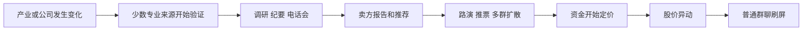
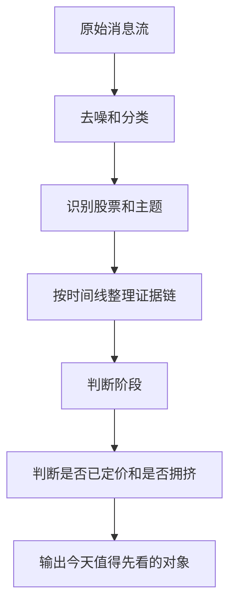

# 从消息理解赚钱逻辑

这份文档记录一次关于 radar 投资逻辑的讨论。

它不是买卖建议，也不是自动交易方案。它的目标是帮助一个股票新手理解：为什么一个每天 3000 到 5000 条微信消息的信息流，可能会被有经验的人看成赚钱线索。

## 先把误区说清楚

刚接触股票时，很容易以为：

```text
看到消息 -> 知道买什么 -> 买入赚钱
```

但老板大概率不是这样看的。

更合理的理解是：

```text
看到消息 -> 判断背后的赚钱逻辑是否正在形成 -> 判断现在早不早、贵不贵、挤不挤 -> 决定是忽略、观察、深挖、参与，还是退出
```

所以“消息很重要”不是说消息里会直接写买点卖点。

消息重要，是因为它暴露了一个过程：

```text
一个赚钱逻辑从没人信，到少数人信，到很多人信，再到太多人信，正在走到哪一步。
```

## 一句话模型

可以先用这个模型理解：

```text
机会价值 =
真实增量 x 信源质量 x 扩散速度 x 行情确认
/ 已定价程度
```

这里每个词都很关键。

| 项 | 说人话解释 | 老板心里可能怎么想 |
| --- | --- | --- |
| 真实增量 | 公司或产业是不是真的发生了变化 | 这件事会不会改变利润、订单、供需、估值想象？ |
| 信源质量 | 谁先说、有没有专业来源验证 | 是随口喊票，还是调研、纪要、卖方、产业链反馈？ |
| 扩散速度 | 有没有从少数人扩散到多个来源 | 是孤立消息，还是不同群、不同人开始接力？ |
| 行情确认 | 股价和成交额有没有开始反应 | 市场有没有开始相信这个逻辑？ |
| 已定价程度 | 现在价格反映了多少 | 现在参与是吃主升，还是接最后一棒？ |

真正想找的不是“最热的消息”，而是：

```text
还没有被充分定价的真实增量。
```

## 消息扩散链

一条有价值的信息，通常不是突然从群聊里凭空出现。

它更像这样扩散：



小白容易把 `H 普通群聊刷屏` 当成机会开始。

老板可能刚好相反：看到刷屏时，他会先想“是不是已经晚了”。

## 老板看到一条消息时，心里可能问什么

如果我是老板，我不会先问“买不买”。

我会先问这些问题：

1. 这条消息有没有新东西？
2. 它说的是结果，还是原因？
3. 谁先说的？这个来源以前准不准？
4. 有没有第二个独立来源确认？
5. 能不能落到具体股票？
6. 这个股票和逻辑绑定强不强？
7. 股价已经涨了多少？
8. 现在是早期、扩散、定价，还是拥挤？
9. 后面还有没有新证据继续推？
10. 如果错了，反证会是什么？

这套问题其实就是老板脑子里的过滤器。

radar 要做的，不是替他凭空预测股价，而是把这个过滤器显性化。

## 阶段怎么判断

可以先把阶段拆成五类。

| 阶段 | 消息表现 | 老板心里可能的判断 | 更合理的动作 |
| --- | --- | --- | --- |
| 线索期 | 少数高质量来源提到，讨论还不多 | 可能有东西，但还不能下结论 | 放观察池 |
| 成型期 | 出现订单、涨价、调研、业绩、供需等硬逻辑 | 逻辑开始能讲通 | 深挖证据链 |
| 扩散期 | 多个来源、多群、多卖方开始说同一逻辑 | 市场正在形成共识 | 判断是否还能参与 |
| 定价期 | 股价和成交额明显响应 | 市场已经开始相信 | 看新增证据是否跟得上 |
| 拥挤期 | 群里刷屏，重复转发，大家问还能不能买 | 信息差可能快消失 | 不追、复盘、找反证 |

这里最重要的是：阶段不是由单条消息决定的。

阶段要看一条时间线：

```text
最早是谁说的
-> 后来谁确认了
-> 是否绑定股票
-> 股票什么时候开始涨
-> 群聊什么时候开始刷屏
-> 新消息是在补充证据，还是重复旧逻辑
```

## 买，不是看到消息就买

如果非要把老板的“买”抽象出来，它可能不是一个点，而是一个状态变化：

```text
忽略 -> 观察 -> 深挖 -> 可以参与
```

从“观察”变成“可以参与”，通常需要同时满足几件事：

- 逻辑有真实增量，不只是情绪口号。
- 至少有一个相对高质量来源。
- 有第二个独立来源或后续证据确认。
- 逻辑能落到具体股票，而不是空泛题材。
- 股票还没有明显过热。
- 股价开始有反应，但没有把逻辑完全打满。
- 后续还有扩散空间或业绩兑现空间。

换句话说，买点不是“消息出现”。

更像是：

```text
逻辑已经够清楚，但市场还没有完全定价。
```

## 卖，也不是等坏消息才卖

很多新手以为卖出必须等坏消息。

但老板可能不是这样想。他更可能看的是：原来的赚钱逻辑有没有走完。

常见的退出或降风险理由：

- 原来的增量已经被市场充分定价。
- 新消息开始变少，重复转发开始变多。
- 股价涨幅已经远大于新增证据。
- 群里从专业讨论变成情绪刷屏。
- 出现反证，比如订单不及预期、涨价落空、业绩低于预期。
- 龙头已经很拥挤，资金开始切低位补涨或分支题材。
- 自己原来的买入理由已经不成立。

卖点也不是“某条消息出现”。

更像是：

```text
逻辑还能继续推股价的证据变少了，但价格已经反映很多了。
```

## 老板不会在消息里操作，这意味着什么

老板不一定会在聊天里写“我买了”“我卖了”。

所以 `sender = 自己发` 不能直接当成交易日志。

它更可能是几类东西：

- 他关注什么。
- 他转发什么。
- 他觉得什么值得别人看。
- 他什么时候开始提醒风险。
- 他什么时候从“新机会”改口成“别追”“太高”“兑现”。
- 他什么时候开始讨论另一个分支或低位补涨。

这些不是交易动作，但它们是思考痕迹。

radar 可以把这些痕迹当成“老板关注状态”的变化，而不是直接当成买卖。

## 对程序员来说，应该怎么理解

可以把这件事类比成日志分析。

原始微信消息不是答案，它只是日志。



这里最像程序员工作的地方是：

- 从海量日志里找异常。
- 区分一次性噪声和持续信号。
- 判断事件从哪里开始、怎么传播、什么时候扩大。
- 用后验数据验证这个判断有没有价值。

所以这个平台不是“炒股机器人”。

更像是：

```text
投资消息的可观测性系统。
```

## radar 应该帮我看见什么

作为小白，最需要系统帮你看见这些东西：

1. 今天哪些股票突然进入视野？
2. 这只股票最早是什么时候被提到的？
3. 最早提到的人是谁？
4. 当时说的是硬逻辑，还是泛泛推荐？
5. 后面有没有其他来源跟进？
6. 现在已经扩散到几个群、几个人？
7. 股价从最早线索到现在涨了多少？
8. 现在是线索期、成型期、扩散期、定价期，还是拥挤期？
9. 老板有没有在类似阶段转发、评论或提醒过？
10. 如果现在再看，是深挖、观察、复盘，还是警惕追高？

这些问题回答好了，小白才能从“看到很多消息”变成“看懂一条逻辑怎么赚钱”。

## 一个简单例子

假设今天很多人在聊 `某电子股`。

小白可能只看到：

```text
很多群都在说，应该很强。
```

老板可能会倒查：

```text
20 天前：有人说产业链缺货，但没人讨论股票。
15 天前：出现调研和专家会。
10 天前：卖方开始写推荐，绑定到这只股票。
5 天前：多个群开始转发同一逻辑。
今天：股价已经涨了 35%，群里开始问还能不能买。
```

这时老板未必会觉得“今天很热所以买”。

他可能会想：

```text
逻辑是真的，但早期收益已经走了一段。
现在要看有没有新的增量。
如果没有，只因为群里热就追，风险变大。
```

这就是消息面和技术面不同的地方。

技术面看到的是价格已经发生了什么。

消息面想判断的是：

```text
推动价格变化的逻辑，还能不能继续。
```

## 每天读证据链的模板

看 radar 的个股证据链时，不要一上来就问“买不买”。

先按下面 7 个问题读。

```text
1. 这条逻辑是什么？
2. 是谁最早说的？
3. 后面有没有独立来源确认？
4. 股票有没有开始涨？
5. 涨幅是不是已经很大？
6. 新消息是在补证据，还是重复旧话？
7. 现在更像观察、深挖、扩散确认，还是追高风险？
```

每个问题对应的含义是：

| 问题 | 你要学会看的东西 | 常见误区 |
| --- | --- | --- |
| 这条逻辑是什么？ | 订单、涨价、供需、政策、业绩、技术突破、估值修复等真实增量 | 只看到股票名，没有看懂为什么涨 |
| 是谁最早说的？ | 早期来源、专业来源、是否来自高质量研究或产业反馈 | 把后面转发的人当成源头 |
| 有没有独立来源确认？ | 不同发送人、不同群、不同机构是否说同一件事 | 把同一段话多次转发误判成多源验证 |
| 股票有没有开始涨？ | 市场是否已经开始相信这个逻辑 | 只看消息，不看价格反应 |
| 涨幅是不是已经很大？ | 逻辑被价格反映了多少 | 好逻辑出现时才追，忽略已经涨完一段 |
| 是补证据还是重复旧话？ | 新消息有没有新增信息 | 把重复刷屏当成新催化 |
| 现在是什么动作状态？ | 观察、深挖、扩散确认、复盘、警惕追高 | 把所有阶段都理解成买点 |

读完以后，用一句话给自己下结论：

```text
这不是买卖建议。
我现在只是判断：这条逻辑处在什么阶段，价格反映了多少，下一步要验证什么。
```

## 阶段确认：消息证据加市场验证

微信消息只能证明“有人在讲什么逻辑”。

它不能单独证明：

- 市场已经相信。
- 股价一定会涨。
- 逻辑已经兑现。
- 现在还有好的参与位置。

所以阶段判断至少要两类证据：

```text
消息证据：逻辑有没有形成、有没有扩散
市场验证：价格和成交量有没有确认、有没有过度反映
```

### 消息证据看什么

消息证据主要看 5 件事：

| 维度 | 看什么 | 说明什么 |
| --- | --- | --- |
| 来源 | 谁先说，后面谁跟进 | 来源质量和扩散路径 |
| 逻辑 | 是否有订单、涨价、供需、政策、业绩、技术突破 | 有没有真实增量 |
| 股票绑定 | 是否能落到少数明确股票 | 能不能变成可研究标的 |
| 扩散 | 多少发送人、多少会话、多少机构重复提 | 市场关注是否扩大 |
| 新旧 | 新消息是在补证据，还是重复旧话 | 是否还有边际增量 |

### 市场验证看什么

市场验证主要看 4 件事：

| 维度 | 看什么 | 说明什么 |
| --- | --- | --- |
| 涨跌幅 | 早期线索到现在涨了多少 | 逻辑被价格反映多少 |
| 成交额 | 成交是否明显放大 | 是否有资金参与定价 |
| 回撤 | 从高点回撤多少 | 前期定价是否过快 |
| 位置 | 是否已经连续大涨或接近高位 | 是否有追高风险 |

在 radar 里，市场验证主要来自本地 Tushare 日线缓存：

```text
close：收盘价
pct_chg：当日涨跌幅
amount：成交额
amount_vs_prev5：成交额相对前 5 日均值
```

`amount_vs_prev5` 可以粗略理解为量能放大倍数。比如 `2.0x` 就是当天成交额约等于前 5 天均值的 2 倍。

### 需要多少证据

这个问题没有固定答案，但当前 radar 的候选召回有一个底线。

```text
热度通道：
去重触发 >= 7

早期强证据通道：
去重触发 >= 3
AND 发送人 >= 2
AND 会话 >= 2
AND 有催化词或强证据分 >= 8
```

注意：这是“值得倒查证据链”的门槛，不是买点门槛。

阶段确认要再看消息证据和市场验证的组合。

| 阶段 | 消息证据 | 市场验证 | 小白该怎么理解 |
| --- | --- | --- | --- |
| 线索 / 种子 | 少量专业来源，有调研、会议、早期催化 | 没有明显上涨，成交不放大 | 先放观察池 |
| 成型 / 论证 | 逻辑完整，有订单、涨价、业绩、政策等框架 | 价格还没明显反映，甚至下跌 | 深挖，不等于马上买 |
| 扩散 | 多来源、多会话、多机构重复传播 | 可以未涨，也可以刚开始涨 | 逻辑进入市场视野 |
| 定价 | 多来源传播，同时股价上涨、涨停或成交放大 | 价格已经明显反映 | 不再是早期，重点看新增证据 |
| 拥挤 | 定价后继续刷屏、观点趋同、追高情绪强 | 高位大涨后量价过热或开始剧烈分歧 | 优先复盘和找反证 |

当前本地样本里，系统对 `拥挤期` 判断比较保守；很多高热案例仍被判为 `定价期`，因为缺少明确的“高位一致追高、观点趋同、群里刷屏问还能不能买”等直接证据。

## 更多案例：消息证据和市场验证怎么一起看

下面这些案例来自当前本地个股证据链的摘要。这里只讲模式，不贴原始聊天正文。

### 山东路桥：种子期

消息证据：

- 多次出现天风、广发、国泰海通等调研、策略会、电话会。
- 但主要是活动和关注，没有明确的订单、业绩上修、涨价、供需变化。

市场验证：

- 股价从约 `5.54` 到 `5.08`，没有放量上涨。
- 成交额没有持续放大。

为什么是种子期：

```text
有人开始看
但逻辑还没有讲透
市场也没有确认
```

小白容易误判：有调研就是机会。

正确理解：这是观察池，不是买点。

### 东方电缆：论证期

消息证据：

- 有海风十五五规划、订单超预期、Q2 业绩强兑现、估值吸引力等完整逻辑。
- 还有中标合计 `52.31 亿` 这类硬证据。

市场验证：

- 股价从 `58.6` 跌到 `37.59`，跌幅约 `35.9%`。
- 期间没有明显放量突破。

为什么是论证期：

```text
逻辑已经能讲清楚
但市场还没有用价格确认
```

小白容易误判：逻辑完整就应该马上涨。

正确理解：逻辑完整只是深挖理由，后面还要等价格和成交验证。

### 中国太保：论证期

消息证据：

- 保险估值修复、NBV 增长、二季报盈利反转预期。
- 多家非银团队反复推荐。

市场验证：

- 股价整体横盘偏弱。
- 最新单日上涨 `3.04%`，但还没有突破前高，也没有极端放量。

为什么是论证期：

```text
研究逻辑成立
但还没有变成强交易
```

正确理解：后面要验证二季报和股价是否放量突破。

### 科达利：扩散期但未完全定价

消息证据：

- 机器人 PPA、谐波减速器、特斯拉量产等催化反复出现。
- 多家机构、多会话持续推荐。

市场验证：

- 6 月 8 日放量上涨 `6.41%`。
- 但最新价仍低于前高，说明还没有完全打满。

为什么是扩散期：

```text
多源传播已经形成
价格开始响应
但还没有进入完全定价或拥挤
```

正确理解：这是扩散确认，下一步盯订单落地和是否突破前高。

### 中化国际：扩散接近定价

消息证据：

- 多券商、多会话、多分析师密集推荐和路演。

市场验证：

- 多次涨停或接近涨停。
- 但最新成交额变小，需要观察后续量能。

为什么还是扩散而不是直接定价：

```text
消息扩散很强
价格也开始反映
但后续量能和新增证据还需要确认
```

正确理解：涨停不是结论，要看后面有没有新催化和持续成交。

### 炬光科技：扩散后大幅回撤

消息证据：

- CPO、光通信、微光学器件逻辑完整。
- 多家机构、多会话持续推荐。

市场验证：

- 5 月中旬曾冲到 `516.7`。
- 6 月 10 日回到 `282.38`，明显大幅回撤。

为什么仍是扩散案例：

```text
消息面确实扩散过
但价格后来明显回落
说明前期定价可能过快，或后续证据没有跟上
```

正确理解：推荐很多不等于风险低。要看推荐发生在上涨前、上涨中，还是高位之后。

### 风华高科：定价期

消息证据：

- MLCC 涨价、AI 算力需求、供需错配、专家交流、反路演。
- 多家机构连续推荐。

市场验证：

- 股价从 `29.45` 到 `59.81`，涨幅约 `103%`。
- 多次涨停，成交额多次放大。

为什么是定价期：

```text
消息逻辑很强
市场已经用价格和成交额快速确认
```

小白容易误判：逻辑强，所以现在还能追。

正确理解：这时第一问题变成“还有没有新增量”，不是“逻辑是否好”。

### 生益科技：定价期

消息证据：

- CCL 涨价、海外算力、AI PCB、供应链份额提升。
- 多家机构持续强推。

市场验证：

- 股价从 `94.18` 到 `146.9`，涨幅约 `56%`。
- 多次涨停，成交额显著放大。

为什么是定价期：

```text
逻辑扩散和价格上涨同步发生
市场已经明显相信
```

正确理解：后面要盯业绩兑现和订单拉货，而不是只看过去涨得好。

### 中际旭创：定价期加拥挤风险

消息证据：

- 光模块核心标的。
- 10 家券商金股、多会话讨论、电话会频繁。

市场验证：

- 从 `857.5` 到 `1147`，涨幅约 `33.8%`。
- 5 月 11 到 12 日连续放量大涨。

为什么是定价期：

```text
共识强
价格也已经明显反映
```

为什么有拥挤风险：

```text
推荐机构很多
讨论非常密
市场关注度极高
```

正确理解：共识越强，越要问还有没有预期差。

### 中微公司：定价后回撤

消息证据：

- 存储扩产、设备订单上修、半导体设备景气。
- 5 月 15 日前后多源强 call。

市场验证：

- 5 月 15 日涨 `11.81%`。
- 当天成交额约 `160.19 亿`，约为前 5 日均值 `2.17x`。
- 后续从高点回撤约 `33%`。

为什么是定价后回撤：

```text
当时消息和成交量共同确认定价
但后续价格回撤说明不能把确认理解成永久上涨
```

正确理解：价格验证后，还要持续跟踪订单和业绩能否继续兑现。

### 华海清科：定价过快后回撤

消息证据：

- 订单大幅上修、平台化、存储扩产、设备订单释放。
- 多家电子团队密集更新。

市场验证：

- 5 月 12 到 19 日连续大涨和放量。
- 最新价格从高点回撤约 `34%`。

为什么是定价过快：

```text
逻辑被市场快速相信
但价格后来明显回撤，说明前期可能反映太快
```

正确理解：好逻辑也会因为涨太快而变成难参与。

## 从案例归纳出的判断表

| 模型类型 | 消息证据 | 市场验证 | 学习重点 |
| --- | --- | --- | --- |
| 有人开始看 | 调研、策略会、电话会 | 不涨、不放量 | 观察池 |
| 逻辑讲通但市场不认 | 订单、涨价、业绩、政策逻辑完整 | 横盘或下跌 | 等验证 |
| 多源扩散但未打满 | 多机构、多会话、多发送人 | 小幅上涨或低于前高 | 看是否进入定价 |
| 消息和价格共振 | 多源强推，逻辑完整 | 涨停、放量、明显上涨 | 定价期，别当早期 |
| 定价后回撤 | 前期强逻辑强扩散 | 高点后大幅回撤 | 检查是否证伪或过度定价 |
| 高共识高热度 | 很多机构推荐、观点趋同 | 高位大涨或量能过热 | 警惕拥挤 |

## 小白学习卡模板

后续 radar 应该把每个案例直接翻译成这种卡片。

```text
股票：
当前阶段：
一句话逻辑：

小白第一眼可能会误判：

老板可能会先看：

证据链真正说明了什么：

价格已经反映了多少：

现在最关键的风险：

接下来两天要验证：

几天后复盘：
```

这张卡片的目标不是让你马上交易，而是训练你看懂三件事：

- 什么是早期线索。
- 什么是逻辑成型。
- 什么是已经定价或拥挤。

## radar 学习模式产品规划

当前 radar 已经有个股证据链，但它更像“阶段判断榜单”。

它能回答：

```text
这只股票现在像什么阶段？
```

但它还不够回答：

```text
我作为小白，应该从这个案例里学会什么？
```

所以后续产品应该加一个“学习模式”。

### P0：今日学习 3 个案例

每天从个股证据链里自动挑 3 类案例：

| 类型 | 学什么 |
| --- | --- |
| 早期线索 | 什么叫还没有充分定价 |
| 发酵确认 | 什么叫逻辑开始被市场相信 |
| 拥挤反例 | 为什么不能看到热就追 |

每个案例都用“小白学习卡模板”解释，不直接给买卖建议。

### P1：阶段变化轨迹

现在的证据链主要看最新阶段。

学习模式要补一条轨迹：

```text
线索期 -> 成型期 -> 扩散期 -> 定价期 -> 拥挤期
```

重点展示：

- 哪一天第一次出现。
- 哪一天开始有第二个来源确认。
- 哪一天绑定具体股票。
- 哪一天股价开始明显响应。
- 哪一天开始刷屏或重复转发。

这能帮助你理解“机会不是突然出现的，而是一层层扩散出来的”。

### P2：老板关注痕迹

`sender = 自己发` 不应该当成交易日志。

它更适合当成老板关注状态：

- 老板什么时候开始转发。
- 老板转发的是早期线索，还是已经扩散后的消息。
- 老板什么时候提醒风险。
- 老板什么时候从主线切到分支或低位补涨。

学习模式要把它叠到证据链上，让你看到：

```text
老板是在什么阶段开始关注这条逻辑的。
```

### P3：已定价程度解释

现在 radar 有市场证据和 K 线，但小白不一定能读懂。

学习模式要把它翻译成：

```text
早期线索出现时涨了多少
逻辑成型时涨了多少
扩散刷屏时涨了多少
现在追是不是价格已经跑在证据前面
```

这一步专门解决追高问题。

### P4：结果状态复盘

只看阶段还不够，还要看后来怎么样。

后续应该给每条逻辑补结果状态：

| 结果状态 | 含义 |
| --- | --- |
| 兑现 | 订单、涨价、业绩真的落地，逻辑继续有效 |
| 证伪 | 关键假设没有发生，或出现反证 |
| 衰减 | 后续没有新证据，热度自然下降 |
| 分叉 | 主逻辑走热后，市场开始找分支或低位补涨 |

这能帮助你复盘：

```text
当时看起来对的逻辑，后面到底有没有兑现？
```

### P5：叙事级建模

现在个股证据链是按股票聚合。

但真正的投资逻辑往往是叙事：

```text
MLCC 涨价
AI 服务器供需
保险估值修复
海风订单周期
半导体设备国产替代
```

同一只股票可能参与多条叙事。

所以长期应该从：

```text
股票 -> 阶段
```

升级为：

```text
叙事 -> 生命周期
股票 -> 在这条叙事里的参与状态
```

这样才能区分：

- 这只股票本身是不是好。
- 它在这条逻辑里是不是还有预期差。
- 它是不是已经从主线机会变成补涨或拥挤复盘。

## 产品优先级

短期不要急着做自动交易，也不要急着堆更多榜单。

最应该先做的是：

```text
P0 今日学习 3 个案例
P1 阶段变化轨迹
P2 老板关注痕迹
P3 已定价程度解释
P4 结果状态复盘
P5 叙事级建模
```

原因很简单：

```text
radar 最先服务的是我自己。
它应该先帮我把老板脑子里的过滤器学会，再谈更复杂的策略。
```

## 最后记住这几句话

1. 消息不是买卖指令，消息是证据。
2. 老板看的不是“热不热”，而是“热到哪一步了”。
3. 赚钱通常来自预期差，不是来自所有人都知道后的共识。
4. 买点更像“逻辑清楚但未充分定价”。
5. 卖点更像“逻辑走完或价格跑在证据前面”。
6. radar 的价值是还原证据链和阶段，不是直接喊买卖。
7. `自己发` 更适合当作老板关注状态，而不是交易日志。
8. 合规边界要守住：内幕消息、非法荐股、确定性收益承诺，都不能当成平台能力。

## 延伸阅读

建议按这个顺序继续看：

1. `docs/learn/stock-evidence-chain-50-cases.md`
   - 用 50 个真实证据链案例练习阶段判断。
   - 重点看“消息强但价格不认”和“定价后回撤”的反例。
2. `docs/learn/radar-evidence-chain-product-plan.md`
   - 看 radar 现在还缺什么。
   - 看怎么把当前看板升级成学习工作台。
