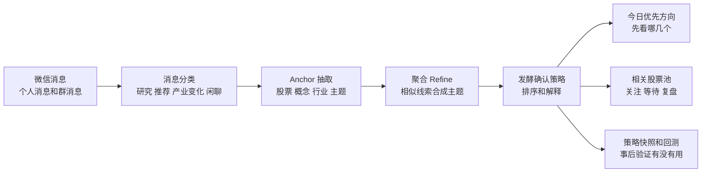
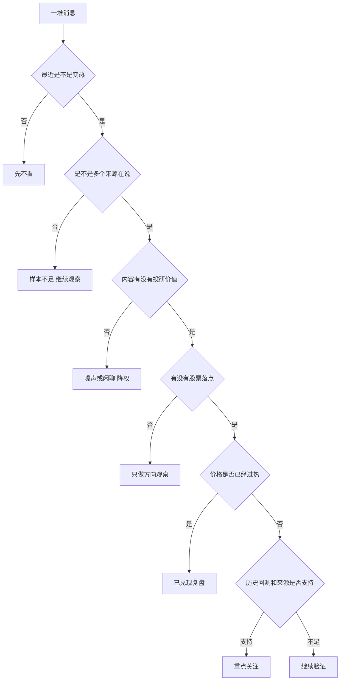
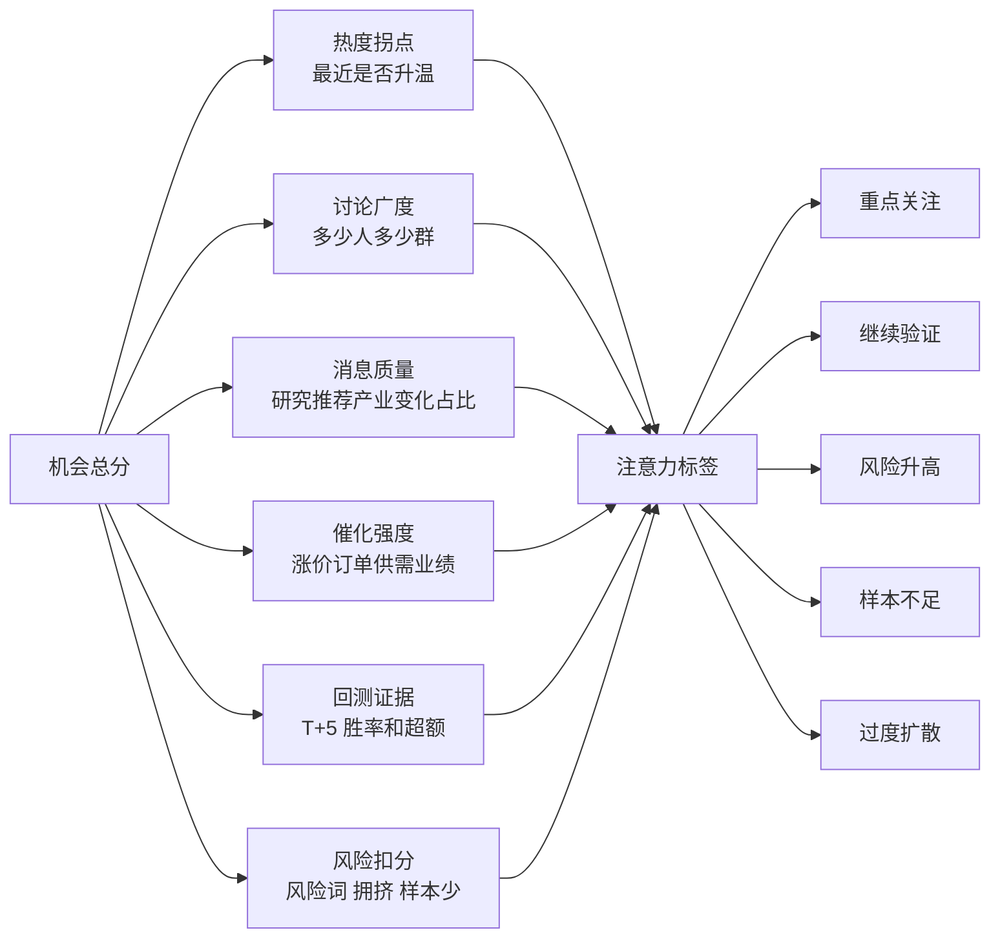
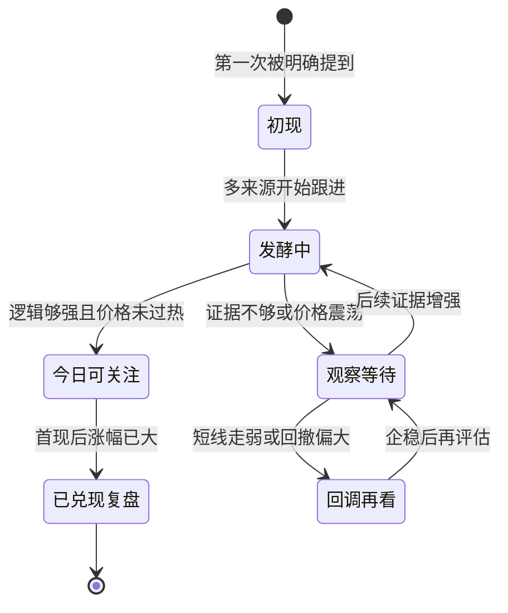
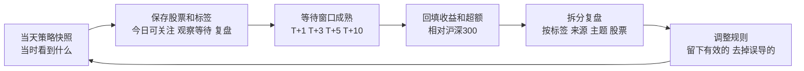

# 发酵确认策略完整方案设计

## 一句话先讲明白

发酵确认策略不是一个“告诉你买哪只股票”的策略。

它更像一个每天帮你整理消息的助手：微信里很多投研消息、群聊讨论、股票推荐、行业变化都挤在一起，人很难一眼看出哪个方向真的值得花时间。这个策略要做的事，就是把已经开始变热的方向挑出来，再告诉你：

- 为什么它值得看。
- 它是刚开始发酵，还是已经太热了。
- 有哪些股票和它有关。
- 这些股票是还能继续观察，还是已经兑现太多。
- 这个信号背后的来源过去靠不靠谱。
- 后面还需要补哪些证据。

简单说，它解决的是“我今天先看什么”的问题，不解决“我现在买不买”的问题。

## 图文版导读

下面这 5 张图是给讲解用的。讲的时候可以先不看后面的长文，直接按图走：

1. 先看“整体链路”，知道数据从哪里来，最后变成什么。
2. 再看“决策漏斗”，知道策略怎么一步步筛掉噪声。
3. 再看“评分结构”，知道为什么某个方向会排在前面。
4. 再看“股票状态”，知道为什么同一个股票有时是关注，有时是复盘。
5. 最后看“回测闭环”，知道这套东西怎么持续验证，而不是靠感觉。

## 背景

radar 的数据来源主要是微信里的个人消息和群消息。这些消息里有很多投研线索，比如：

- 某个行业开始涨价。
- 某家公司拿到订单。
- 某个概念被多个群反复提到。
- 有分析师或消息源开始推荐某几只股票。
- 某个方向从冷门变成大家都在讨论。

这些线索很有价值，但也很乱。

如果每天靠人自己翻消息，会遇到几个问题：

- 消息太多，看不完。
- 很多消息只是重复转发。
- 有些方向看起来很热，但可能已经涨完了。
- 有些方向刚开始有苗头，但容易被埋在消息流里。
- 有些来源历史上有效，有些来源只是噪声。
- 同一个主题可能有很多叫法，比如概念、行业、股票、题材混在一起。

所以 radar 先把消息做成一批离线产物：

- 原始消息：谁在什么时候说了什么。
- 消息分类：这条消息是研究观点、推荐、产业变化，还是普通闲聊。
- anchor 抽取：消息里提到了哪些股票、概念、行业、主题。
- 聚合 refine：把相似消息合成更清楚的主题。
- 推荐回测：看过去某个来源或股票被推荐后，T+1、T+3、T+5 表现怎么样。
- 行情缓存：看相关股票现在是低位、发酵中、已兑现，还是回调偏弱。

发酵确认策略就是把这些产物串起来，变成一张“今天值得确认的方向表”。

## 痛点

### 1. 只看热度容易追高

一个方向很热，不代表它还能继续走。

比如某个题材今天很多群都在说，看起来很强。但它可能已经涨了三四天，最好的买点已经过去了。这个时候再只因为“大家都在聊”就冲进去，很容易变成追高。

所以策略不能只看“提到次数”，还要看：

- 最近是突然升温，还是一直都很热。
- 相关股票已经涨了多少。
- 有没有明显回撤。
- 是否已经进入“已兑现复盘”的阶段。

### 2. 只看单条消息容易被噪声带偏

一条消息可能很刺激，但不一定靠谱。

比如有人说“某某股空间巨大”，这句话本身没有太多信息。真正有价值的是：

- 有没有涨价、订单、供需缺口、政策、业绩这样的逻辑。
- 是否有多个来源也在说。
- 首次提出这个方向的人，历史上有没有过有效信号。
- 这条消息是不是一次性列了一大堆股票。

所以策略要区分“有逻辑的线索”和“热闹的喊票”。

### 3. 人每天时间有限

投资人每天不是想看所有数据，而是想快速知道：

- 今天最该先看哪几个方向。
- 每个方向为什么上榜。
- 相关股票里哪些值得打开 K 线看。
- 哪些只是继续观察。
- 哪些已经不适合追了。

这就是注意力排序问题。

### 4. 回测和当前信号经常断开

很多系统会告诉你“某个方向现在很热”，但不会告诉你这个方向或来源过去表现怎么样。

发酵确认策略希望把历史回测接进来。不是为了迷信过去，而是为了给今天的信号加一层现实检验：

- 这个来源过去提到股票后，T+5 胜率怎么样。
- 这个股票过去被推荐后，平均超额收益怎么样。
- 样本够不够。
- 如果样本很少，就不能给太强结论。

## 目标

### 核心目标

把微信消息里的已发酵线索，整理成每天可用的研究优先级。

更直白地说，就是让用户打开 radar 后不用自己翻几千条消息，先看到：

- 哪些方向正在升温。
- 哪些方向值得继续确认。
- 哪些方向风险已经变高。
- 哪些股票可以今天先看一眼。
- 哪些来源最近更值得重视。

### 不做什么

这套策略明确不做：

- 不直接给买入、卖出建议。
- 不做仓位建议。
- 不替代基本面研究。
- 不保证一定赚钱。
- 不单靠 K 线预测走势。
- 不把“热度高”简单等同于“机会大”。

它的定位是研究助手，不是自动交易系统。

## 逻辑思维设计

这套策略的思考方式可以拆成五句话。

### 第一步：先问“是不是在变热”

如果一个方向最近突然被更多人提到，说明它可能正在发酵。

这里看的是最近窗口和过去窗口的对比。

比如最近 7 天提到 30 次，之前 23 天只提到 10 次，这就说明它在加速。反过来，如果一直都很多人说，但最近没有明显变多，就不能简单当成新机会。

### 第二步：再问“是不是多人在说”

单个来源说，可信度有限。

多个群、多个发送人都开始提，说明这个方向可能已经开始扩散。

这并不是说人越多越好。人太多也可能代表已经拥挤。所以策略既要给“扩散”加分，也要给“过度扩散”降分。

### 第三步：再问“内容有没有价值”

同样是 20 条消息，价值差别很大。

如果大部分是研究观点、产业变化、明确推荐，这比普通聊天更有用。

如果消息里有涨价、订单、供不应求、量产、业绩、政策这样的催化词，说明它有更清楚的逻辑。

如果消息里出现砍单、降价、库存、下修、不及预期、监管这样的风险词，就要降权。

### 第四步：再问“股票有没有落点”

一个主题如果完全落不到股票，就只能作为方向观察。

发酵确认策略会尝试把主题和股票连起来：

- 这个方向关联哪些股票。
- 每只股票被多少来源提到。
- 首次出现是什么时候。
- 首次出现后涨了多少。
- 现在是初现、发酵中、已兑现，还是回调再看。

这样用户看到的不只是一个概念名，而是能继续研究到具体标的。

### 第五步：最后问“历史上有没有证据”

策略会看已有的推荐回测结果。

比如：

- 这个来源过去推荐后，T+5 胜率如何。
- 这个股票过去被推荐后，平均超额收益如何。
- 样本数够不够。

如果历史表现好，而且今天的消息也有逻辑，那就更值得优先看。

如果历史样本很少，策略会提示“样本不足”，而不是假装很确定。

## 策略拆解

### 1. 输入层：先把消息变成可计算的东西

原始微信消息本身不能直接打分。它们需要先变成结构化数据。

主要输入包括：

| 输入 | 用途 |
| --- | --- |
| 原始消息 | 看时间、来源、群、发送人、内容 |
| 消息分类 | 判断是研究、推荐、产业变化，还是低价值聊天 |
| anchor | 找出股票、概念、行业、主题 |
| 聚合主题 | 把相似线索合成更清楚的主题 |
| 推荐回测 | 看历史胜率、平均收益、平均超额 |
| 行情缓存 | 判断股票位置和发酵阶段 |

这一层的目标是先把“散乱消息”变成“可分析信号”。

### 2. 机会层：找正在升温的方向

策略会从 anchor 和主题里找候选机会。

一个候选机会大概长这样：

- 名称：比如 MLCC、算力、先进封装。
- 类型：股票、概念、行业或主题。
- 最近消息数。
- 过去消息数。
- 发送人数。
- 群数量。
- 高价值消息数量。
- 催化词数量。
- 风险词数量。
- 相关回测结果。

然后策略先做一轮排序，把明显更值得看的方向放到前面。

### 3. 打分层：用规则给关注优先级

第一版用规则评分，不靠新的 LLM。

分数主要来自六块：

| 维度 | 加分逻辑 | 大白话解释 |
| --- | --- | --- |
| 热度拐点 | 最近明显比过去更热 | 它是不是正在升温 |
| 讨论广度 | 更多来源和群参与 | 是不是不止一个人在说 |
| 消息质量 | 研究、推荐、产业变化占比高 | 讨论是不是有投研价值 |
| 催化强度 | 涨价、订单、供需等词更多 | 有没有能推动行情的原因 |
| 回测证据 | 历史 T+5 表现更好 | 过去类似信号有没有效果 |
| 风险和拥挤 | 风险词多、过热、样本太少会扣分 | 防止追高和过度自信 |

最后输出的不是买卖建议，而是注意力标签。

### 4. 标签层：把复杂分数翻译成人话

策略输出五种标签：

| 标签 | 意思 | 用户该怎么用 |
| --- | --- | --- |
| 重点关注 | 证据较强，今天优先看 | 点进去看原文、股票、K 线 |
| 继续验证 | 有线索，但还不够确定 | 等更多来源或价格确认 |
| 风险升高 | 有机会也有明显风险 | 谨慎，不要只看好的一面 |
| 样本不足 | 消息太少，不能下结论 | 放观察池，不要过度解读 |
| 过度扩散 | 太多人都在说，可能已拥挤 | 更适合复盘，不适合追 |

这样做的好处是，用户不用理解所有算法细节，也能知道下一步动作。

### 5. 股票层：把主题落到可研究标的

策略不是只给一个概念名，还要把它关联到股票。

股票会被分成三类：

| 分类 | 意思 |
| --- | --- |
| 今日可关注 | 信号还在发酵，价格位置没明显过热，来源和事件质量也过线 |
| 观察等待 | 有线索，但价格、来源、样本或逻辑还不够 |
| 已兑现复盘 | 首现后涨幅已经比较大，更适合复盘，不适合追高 |

这里非常重要：今日可关注也不是买入建议，只是“值得打开看看”。

### 6. 验证层：保存快照，事后回填结果

如果只看今天，很容易事后解释。

所以策略要保存每天的快照：

- 当天策略看到什么。
- 当天哪些股票排在前面。
- 当天为什么给这个标签。
- 当天的价格位置是什么。

等 T+1、T+3、T+5、T+10 成熟后，再回填收益和超额收益。

这样才能回答一个关键问题：

这套策略到底有没有用？

## 解决什么问题

### 1. 从“消息太多”变成“先看 Top 几个”

原来用户要自己翻消息。

现在策略先把机会排好序，帮用户节省时间。

### 2. 从“感觉很热”变成“知道为什么热”

策略不会只说某个方向很热。

它会解释热度来自哪里：

- 最近提到次数变多。
- 多个来源参与。
- 高价值消息占比高。
- 有催化词。
- 有历史回测支持。

### 3. 从“看到股票名”变成“知道处在什么阶段”

同一只股票，被提到的意义可能完全不同。

如果刚出现，可能值得跟踪。

如果已经涨了 25%，那更适合复盘。

如果回撤很大，就要等企稳。

策略用生命周期和价格位置来避免把所有股票都当成同一种机会。

### 4. 从“看热闹”变成“看证据”

策略会把来源、样本、回测、催化、风险一起摆出来。

这能帮助用户少被情绪带着走。

### 5. 从“今天看完就算了”变成“长期验证”

保存快照后，就能不断问：

- 哪类标签更有效。
- 哪些来源更有效。
- 哪些主题容易追高。
- 哪些股票池更容易跑赢。
- 哪些规则需要调。

这让策略能迭代，而不是靠感觉。

## 一个简单例子

假设今天策略里出现了“MLCC”。

它被打成“重点关注”，可能是因为：

- 最近 7 天 MLCC 相关消息明显变多。
- 不止一个群在聊。
- 不止一个发送人在提。
- 消息里出现“涨价”“供需改善”“订单”。
- 相关股票过去 T+5 回测有正超额。
- 风险词不多。
- 相关股票还没有全部进入已兑现阶段。

用户看到后，正确动作不是直接买。

更合理的动作是：

1. 点进去看原始消息。
2. 看是谁先提的，在哪个群提的。
3. 看相关股票的 K 线位置。
4. 看有没有公告、业绩、订单、涨价等公开证据。
5. 如果价格已经太高，就只复盘，不追。
6. 如果证据还不够，就放观察池等后续扩散。

## 当前改进点

### 1. 需要更好地区分“早期”和“已发酵”

发酵确认策略本身是确认层，不是抢最早的策略。

如果用户真正想解决追高问题，应该和“早期概念雷达”配合：

- 早期概念雷达负责发现种子线索。
- 发酵确认策略负责判断它后面有没有扩散、有没有继续研究价值。
- 如果已经过热，发酵确认策略应该提示复盘，而不是继续鼓励追。

### 2. 风险词还比较粗

现在风险词主要靠固定词表。

它能抓到一些明显风险，比如砍单、降价、库存、下修。但真实风险可能更复杂，比如：

- 逻辑被证伪。
- 同行业出现反向数据。
- 来源只是重复转发。
- 价格已经提前反映。
- 市场风格不支持。

后续可以让 LLM 专门抽取“反证”和“风险原因”，但第一版先不急。

### 3. 催化词需要更细

同样是“订单”，质量也不一样。

比如：

- 真实中标公告比传闻更强。
- 大客户订单比普通订单更强。
- 一次性订单和长期供需变化也不一样。

后续可以把催化拆成更细的类型：价格、订单、政策、供需、业绩、技术突破、客户变化。

### 4. 股票映射需要继续变准

主题到股票的映射如果不准，策略就会推荐错误的研究对象。

比如一个行业主题可能关联很多股票，但真正受益的只有其中几只。后续需要更好地区分：

- 核心受益股。
- 跟风股。
- 只是被顺带提到的股票。
- 已经兑现的股票。
- 还没涨但逻辑弱的股票。

### 5. 回测需要按标签拆开看

不能只看总胜率。

更有价值的是看：

- “今日可关注”到底有没有跑赢。
- “观察等待”后续是否变成机会。
- “已兑现复盘”是否真的避免了追高。
- “高可信来源”是否比普通来源好。
- “风险升高”是否真的回撤更大。

这些能反过来调整策略规则。

### 6. 需要加入人工复盘入口

策略再聪明，也不能完全替代人。

后续可以给每个机会加一个复盘字段：

- 这个信号后来对了吗。
- 当时判断错在哪里。
- 是消息噪声、股票映射、行情位置，还是来源质量问题。
- 下次规则应该怎么改。

这样策略会越来越贴近真实投资过程。

## 后续路线

### 第一阶段：把解释讲清楚

目标是让用户看懂每个机会为什么上榜。

重点做：

- 每个机会有一句话原因。
- 每个机会有风险摘要。
- 每个股票有决策标签。
- 每个标签有可理解的下一步动作。

### 第二阶段：把验证做扎实

目标是知道策略到底有没有效果。

重点做：

- 每天保存策略快照。
- 回填 T+1、T+3、T+5、T+10。
- 按标签、来源、主题、股票池拆结果。
- 找出真正有效和无效的规则。

### 第三阶段：补更细的理解能力

如果规则不够用了，再引入更细的 LLM 抽取。

重点做：

- 抽取更清楚的催化类型。
- 抽取反证和风险原因。
- 判断消息是不是重复转发。
- 判断股票是不是核心受益。
- 生成更像人话的策略解释。

### 第四阶段：和早期概念雷达形成闭环

最终理想链路是：

1. 早期概念雷达发现新线索。
2. 股票首次绑定，放进观察池。
3. 后续多个来源开始讨论，进入发酵确认策略。
4. 发酵确认策略判断是否继续看、等待、复盘或风险升高。
5. 快照回测验证策略是否真的有效。

这样 radar 就不是一个“消息展示工具”，而是一个能帮助投资人分配注意力、控制追高、持续复盘的研究工作台。

## 给女朋友讲的版本

如果要用最简单的话解释，可以这样说：

我现在做的这个策略，不是帮我自动炒股。

它像一个每天帮我整理投资消息的小助手。因为我微信里每天有很多股票、行业、券商观点、群聊消息，人自己看很容易漏掉，也容易被热闹的消息带偏。

这个策略会先看哪些方向最近突然被更多人讨论，再看是不是多个来源都在说，再看消息里有没有真实逻辑，比如涨价、订单、业绩、供需变化。然后它还会看相关股票是不是已经涨太多，以及过去类似消息有没有效果。

最后它不会说“买这个”，只会说：

- 这个方向今天值得优先看看。
- 这个方向还要继续验证。
- 这个方向风险有点高。
- 这个股票已经涨多了，更适合复盘。

所以它的真正作用是帮我省时间，少追高，少被噪声影响，把每天有限的精力放在更值得研究的地方。

## 总结

发酵确认策略的核心价值，是把已经开始升温的消息线索变成可解释的研究顺序。

它不追求一次判断对所有事情，而是先解决一个最现实的问题：

今天这么多消息，我到底先看什么？

只要它能稳定帮用户少看无效消息、少追过热方向、多关注有证据的方向，它就有价值。

后续真正重要的不是把规则写得更复杂，而是持续用快照和回测验证：

- 哪些判断真的有用。
- 哪些只是看起来聪明。
- 哪些来源值得跟。
- 哪些方向容易追高。
- 哪些规则应该改。

这才是这套策略长期能进化的关键。
